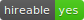
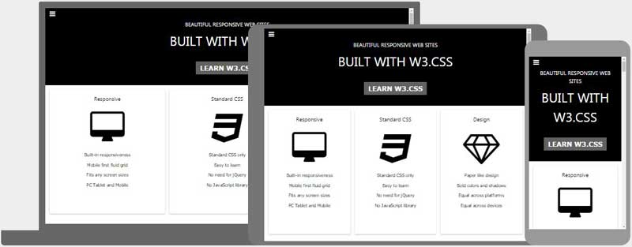

<!--
*** Thanks for checking out this README Template. If you have a suggestion that would
*** make this better, please fork the repo and create a pull request or simply open
*** an issue with the tag "enhancement".
*** Thanks again! Now go create something AMAZING! :D
-->

<!-- PROJECT SHIELDS -->
<!--
*** I'm using markdown "reference style" links for readability.
*** Reference links are enclosed in brackets [ ] instead of parentheses ( ).
*** See the bottom of this document for the declaration of the reference variables
*** for contributors-url, forks-url, etc. This is an optional, concise syntax you may use.
*** https://www.markdownguide.org/basic-syntax/#reference-style-links
-->
[![Contributors][contributors-shield]][contributors-url]
[![Forks][forks-shield]][forks-url]
[![Stargazers][stars-shield]][stars-url]
[![Issues][issues-shield]][issues-url]


<!-- PROJECT LOGO -->
<br />
<p align="center">
  <a href="https://github.com/rammazzoti2000/HTML-CSS-capstone-project">
    
  </a>

  <h3 align="center">HTML/CSS Capstone Project</h3>

  <p align="center">
    This project is part of the Microverse CSS3 and HTML curriculum!
    <br />
    <a href="https://github.com/rammazzoti2000/HTML-CSS-capstone-project/issues"><strong>Explore the docs »</strong></a>
    <br />
    <br />
    <a href="https://rawcdn.githack.com/rammazzoti2000/HTML-CSS-capstone-project/7f9326753720d862b2592569a1fa0cb6d0837f4f/index.html">View Demo</a>
    ·
    <a href="https://github.com/rammazzoti2000/HTML-CSS-capstone-project/issues">Report Bug</a>
    ·
    <a href="https://github.com/rammazzoti2000/HTML-CSS-capstone-project/issues">Request Feature</a>
  </p>
</p>

<!-- TABLE OF CONTENTS -->
## Table of Contents

* [About the Project](#about-the-project)
  * [Built With](#built-with)
* [Live Version](#live-version)
* [Contact](#contact)
* [Acknowledgements](#acknowledgements)

<!-- ABOUT THE PROJECT -->
## About The Project

[![Product Name Screen Shot][product-screenshot]](./img/screenshot.png)

This project is a Capstone Project. Capstone projects are solo projects at the end of the each of the Microverse Main Technical Curriculum modules.

Here are the objectives for this project:

* Build 3 pages as the minimum requirements
	* the main page (search page), with a link to the results page
	* the search results page, with a list of schools each with a link to the detail school page
  * the detail school page

* Each of these pages have versions for 3 different screen sizes
  * mobile: up to 768px
  * tablet: up to 1024px
  * desktop: from 1024px

* It has been followed the guidelines of the given design, including
  * colors (they are not explicitly in the design, but you can pick them from the design page)
  * colors (they are not explicitly in the design, but you can pick them from the design page)
  * layout: composition and space between elements, for the 3 given screen sizes

### Built With
This project was built using these technologies.
* HTML
* CSS3
* LESS (CSS)
* BootStrap
* Stickler
* Atom :atom:

## Usage

If you want to use it locally [download](https://github.com/rammazzoti2000/HTML-CSS-capstone-project/archive/master.zip) or clone the repo with the following command on a linux terminal:

```git clone https://github.com/rammazzoti2000/HTML-CSS-capstone-project.git```

cd to the projects directory and open the index.html in your browser



<!-- LIVE VERSION -->
## Live project demo and Walkthrough Video

:point_right:  [Live demo link](https://rammazzoti2000.github.io/HTML-CSS-capstone-project/)

:point_right:  [Walkthrough Video](https://www.loom.com/share/ff218bb6079c400484d2286d65435a1e)

<!-- AUTOMATED TEST -->
## Automated Test

> There are no Automated Test for this project yet

## Potential future features
- Make it a full stack application using back-end technologies, mainly RubyOnRails
- Improve the front-end

<!-- CONTACT -->
## Contact

👤 Alexandru Bangau - twitter: [@alex_maxinova](https://twitter.com/alex_maxinova) - github: [@ramamzzoti2000](https://github.com/rammazzoti2000) - gmail: bangau.alexandru@gmail.com

## 🤝 Contributing

Contributions, issues and feature requests are welcome!

Feel free to check the [issues page](https://github.com/rammazzoti2000/HTML-CSS-capstone-project/issues).

## Show your support
Give a :star: if you like this project!

<!-- ATTRIBUTIONS AND CREDITS -->
## Credit

Original site design by [Mathew Njuguna and others on Behance](https://www.behance.net/mathewnjuguna)

<!-- ACKNOWLEDGEMENTS -->
## Acknowledgements
* [Microverse](https://www.microverse.org/)
* [The Odin Project](https://www.theodinproject.com/)
* [HTML Cheat Sheet](https://htmlcheatsheet.com/js/)
* [LESS Documentation](http://lesscss.org/)
* [BootStrap Documentation](https://getbootstrap.com/)

## 📝 License

This project is [MIT](https://opensource.org/licenses/MIT) licensed.

<!-- MARKDOWN LINKS & IMAGES -->
<!-- https://www.markdownguide.org/basic-syntax/#reference-style-links -->
[contributors-shield]: https://img.shields.io/github/contributors/rammazzoti2000/HTML-CSS-capstone-project.svg?style=flat-square
[contributors-url]: https://github.com/rammazzoti2000/HTML-CSS-capstone-project/graphs/contributors
[forks-shield]: https://img.shields.io/github/forks/rammazzoti2000/HTML-CSS-capstone-project.svg?style=flat-square
[forks-url]: https://github.com/rammazzoti2000/HTML-CSS-capstone-project/network/members
[stars-shield]: https://img.shields.io/github/stars/rammazzoti2000/HTML-CSS-capstone-project.svg?style=flat-square
[stars-url]: https://github.com/rammazzoti2000/HTML-CSS-capstone-project/stargazers
[issues-shield]: https://img.shields.io/github/issues/rammazzoti2000/HTML-CSS-capstone-project.svg?style=flat-square
[issues-url]: https://github.com/rammazzoti2000/HTML-CSS-capstone-project/issues
[product-screenshot]: ./img/screenshot2.png
